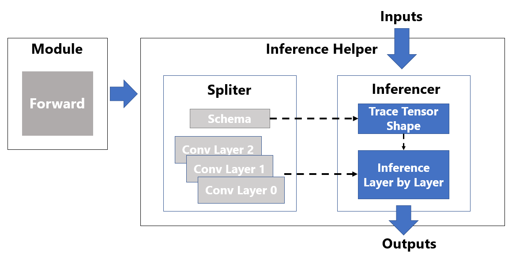

# inference_helper
## 简介
随着输入的图越来越大，现有的硬件设备已经不能满足GNN模型在图上的全邻居训练方式。越来越多的模型采用了采样mini-batch训练的方式。其中，最常用两种采样方式就是邻居采样和子图采样。然而在推理的时候，为了保证精度，推理只能使用全邻居训练，不可以采样。由于CPU的计算速度太慢，我们一般都会采用GPU进行加速推理。但是GPU的显存有限，我们不能将一整张图放进去做全图推理。这导致我们需要mini-batch全图推理。而在mini-batch的全图推理时，由于需要节点所有的邻居信息，即使batch_size很小，生成的图还是会很大。并且，中间层的特征可能会被多个不同的批次所利用，我们只能每一个批次都生成一次。这里产生了大量的重复运算。为了解决这个问题，DGL的实现方法是一层一层地进行推理，即先算完当前层的所有节点的特征，再用该特征去计算下一层。详情可参考[这里](https://docs.dgl.ai/guide/minibatch-inference.html)。

在DGL的文档中我们可以发现，手动实现一个minibatch推理很繁琐。而随着模型变得越来越复杂，用户自己去学习并使用mini-batch推理的难度也逐渐增大。如果有一个通用的推理工具将会大大减少用户的学习成本，提高用户的开发效率。本工作提出了一个根据输入的模型进行自动推理的工具inference_helper。用户只需要写模型，inference_helper会自动追踪forward函数中的消息传递层，并将forward函数切割成数个单层函数。inference_helper还提供了一个推理接口，用户仅需往接口里输入跟forward函数一样的输入，inference_helper会进行自适应推理。

## 开始
```
git clone https://github.com/yinpeiqi/inference_helper.git
cd inference_helper
python setup.py install
```

## 使用
原本inference的使用方式：参考dgl/examples/pytorch/graphsage/train_sampling.py
```python
pred = model.inference(g, nfeat, device, args.batch_size, args.num_workers)
```
使用inference helper:
```python
from inference_helper import InferenceHelper

helper = InferenceHelper(model, args.batch_size, device, num_workers, debug=False)
pred = helper.inference(g, nfeat)
```

## 设计

inference_helper主要包括两个部分：Spliter和Inferencer。输入一个pytorch的模块，Spliter首先会trace这个模块的forward函数。然后将这个forward切割成数个消息传递层，并生成一个记录输入输出的schema。在做推理的时候，输入数据会被送到inferencer里。Inferencer会先用Spliter生成的schema跟卷积层函数计算得出每一个计算过程中每一个需要存到CPU里的张量的维度信息。接下来，就会根据预先计算生成的维度信息，schema以及消息传递层函数来一层一层地进行推理。

### Spliter
Spliter中主要的功能如下：
1. 使用torch.fx将输入的forward转成计算图并做相应变换。
2. 对于生成的计算图，将其按层切割得到数个子计算图，并将输入输出信息记录在schema里。
3. 将生成的计算图转成代码，并将其编译并注册成python函数。

我们首先看一个最简单的GCN模块的例子：
```python
class StochasticTwoLayerGCN(nn.Module):
    def __init__(self, in_features, hidden_features, out_features):
        super().__init__()
        self.hidden_features = hidden_features
        self.out_features = out_features
        self.conv1 = dgl.nn.GraphConv(in_features, hidden_features)
        self.conv2 = dgl.nn.GraphConv(hidden_features, hidden_features)
        self.n_layers = 2

    def forward(self, graph, x0):
        x_dst0 = x0[:graph.number_of_dst_nodes()]
        x1 = F.relu(self.conv1(graph, (x0, x_dst0)))
        x_dst1 = x1[:graph.number_of_dst_nodes()]
        x2 = F.relu(self.conv2(graph, (x1, x_dst1)))
        return x2
```
以上为使用全图训练或者子图采样训练的代码，若使用mini-batch采样进行训练，则输入为一个blocks，代码如下：
```python
    def forward(self, blocks, x0):
        x_dst0 = x0[:blocks[0].number_of_dst_nodes()]
        x1 = F.relu(self.conv1(blocks[0], (x0, x_dst0)))
        x_dst1 = x1[:blocks[1].number_of_dst_nodes()]
        x2 = F.relu(self.conv2(blocks[1], (x1, x_dst1)))
        return x2
```
torch.fx是pytorch内置的动态forward函数分析工具，可以将一个forward函数转化成一个python的计算图IR表示。由于是动态追踪，torch.fx不支持包含控制流的forward函数。以下为torch.fx追踪上述使用mini-batch采样的GCN后得到的结果：
```
graph():
    %blocks : [#users=4] = placeholder[target=blocks]
    %x0 : [#users=2] = placeholder[target=x0]
    %getitem : [#users=1] = call_function[target=operator.getitem](args = (%blocks, 0), kwargs = {})
    %number_of_dst_nodes : [#users=1] = call_method[target=number_of_dst_nodes](args = (%getitem,), kwargs = {})
    %getitem_1 : [#users=1] = call_function[target=operator.getitem](args = (%x0, slice(None, number_of_dst_nodes, None)), kwargs = {})
    %getitem_2 : [#users=1] = call_function[target=operator.getitem](args = (%blocks, 0), kwargs = {})
    %conv1 : [#users=1] = call_module[target=conv1](args = (%getitem_2, (%x0, %getitem_1)), kwargs = {})
    %relu : [#users=2] = call_function[target=torch.nn.functional.relu](args = (%conv1,), kwargs = {inplace: False})
    %getitem_3 : [#users=1] = call_function[target=operator.getitem](args = (%blocks, 1), kwargs = {})
    %number_of_dst_nodes_1 : [#users=1] = call_method[target=number_of_dst_nodes](args = (%getitem_3,), kwargs = {})
    %getitem_4 : [#users=1] = call_function[target=operator.getitem](args = (%relu, slice(None, number_of_dst_nodes_1, None)), kwargs = {})
    %getitem_5 : [#users=1] = call_function[target=operator.getitem](args = (%blocks, 1), kwargs = {})
    %conv2 : [#users=1] = call_module[target=conv2](args = (%getitem_5, (%relu, %getitem_4)), kwargs = {})
    %relu_1 : [#users=1] = call_function[target=torch.nn.functional.relu](args = (%conv2,), kwargs = {inplace: False})
    return relu_1
```
得到该计算图后，我们首先会判断这个计算图的第一个输入参数是一个blocks还是graph。如果采用blocks作为输入，则将blocks改成graph，并替换所有操作。以下为更改后的生成的计算图：
```
graph():
    %blocks : [#users=4] = placeholder[target=blocks]
    %x0 : [#users=2] = placeholder[target=x0]
    %number_of_dst_nodes : [#users=1] = call_method[target=number_of_dst_nodes](args = (%blocks,), kwargs = {})
    %getitem : [#users=1] = call_function[target=operator.getitem](args = (%x0, slice(None, number_of_dst_nodes, None)), kwargs = {})
    %conv1 : [#users=1] = call_module[target=conv1](args = (%blocks, (%x0, %getitem)), kwargs = {})
    %relu : [#users=2] = call_function[target=torch.nn.functional.relu](args = (%conv1,), kwargs = {inplace: False})
    %number_of_dst_nodes_1 : [#users=1] = call_method[target=number_of_dst_nodes](args = (%blocks,), kwargs = {})
    %getitem_1 : [#users=1] = call_function[target=operator.getitem](args = (%relu, slice(None, number_of_dst_nodes_1, None)), kwargs = {})
    %conv2 : [#users=1] = call_module[target=conv2](args = (%blocks, (%relu, %getitem_1)), kwargs = {})
    %relu_1 : [#users=1] = call_function[target=torch.nn.functional.relu](args = (%conv2,), kwargs = {inplace: False})
    return relu_1
```
此处所有blocks的用法都变成了graph（参数的名称不会修改）。得到该计算图后，我们接下来会记录每个call_module使用graph的位置。这些位置即为真正调用消息传递层的地方。我们需要在每两个消息传递层之间找到一个位置“割一刀”。也就是说，假设总共有n个消息传递层，我们在每两个消息传递层之间划一条界限（总共n-1条），即可以得到n个模块。我们将在后续章节描述我们如何对其进行切割，使生成的函数的数据转移量最小。每个模块包含该模块需要进行的操作，并且一定有且仅有一个消息传递层。完成切割的操作的同时，我们会记录：1. 需要用什么变量作为输入；2. 过程中生成的变量是否还需要被后面的函数使用。如果需要则作为输出。输入输出信息将被记录进schema中，用于推理。下图为我们通过切割上述GCN的计算图，生成的计算图转为代码后的结果：
```python
# --------- Layer 0 conv function --------
def forward_conv0(self, graph, x0):
    number_of_dst_nodes = graph.number_of_dst_nodes()
    getitem = x0[slice(None, None, number_of_dst_nodes)];  number_of_dst_nodes = None
    conv1 = self.conv1(graph, (x0, getitem));  graph = x0 = getitem = None
    return conv1
# --------- Layer 1 conv function --------
def forward_conv1(self, graph, conv1):
    relu = torch.nn.functional.relu(conv1, inplace = False);  conv1 = None
    number_of_dst_nodes_1 = graph.number_of_dst_nodes()
    getitem_1 = relu[slice(None, None, number_of_dst_nodes_1)];  number_of_dst_nodes_1 = None
    conv2 = self.conv2(graph, (relu, getitem_1));  graph = relu = getitem_1 = None
    relu_1 = torch.nn.functional.relu(conv2, inplace = False);  conv2 = None
    return relu_1
```
生成计算图后，我们会用torch.fx的lint工具检查这些子计算图是否合法，若合法则使用torch.fx生成python代码。生成的代码为字符串变量，我们会使用python的exec将其重新编译为函数。至此，spliter的工作完成。

### Inferencer
